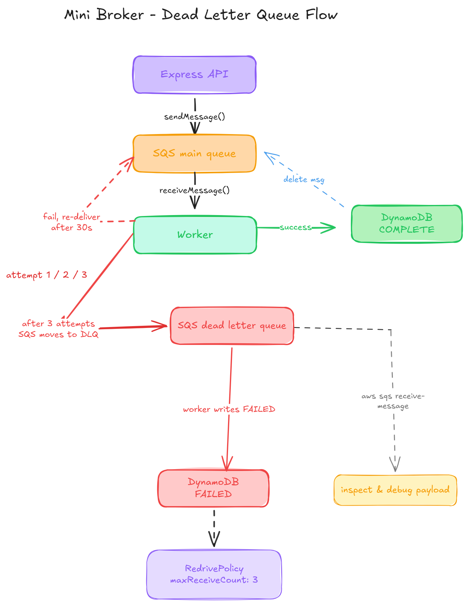

# Mini Broker

> Self-service AWS infrastructure provisioning via a REST API — inspired by how Atlassian built their internal Open Service Broker.

A laid-off Atlassian engineer posted a talk explaining how developers at Atlassian could provision load balancers, DNS records, and CloudFront distributions with a single API call — no tickets, no waiting for an infra team. I watched it and built my own version to understand the pattern.

---

## How it works

**Accept fast. Execute async. Let the client poll.**

```
POST /v2/service_instances/ec2/job-001   →  202 Accepted (instant)
GET  /v2/service_instances/job-001/last_operation  →  PENDING → IN_PROGRESS → COMPLETE
```

1. Developer hits the API with a provisioning request
2. API writes `PENDING` to DynamoDB and drops the job into SQS — returns `202` immediately
3. Worker picks up the job, provisions the real AWS resource, updates DynamoDB
4. Developer polls `/last_operation` until `COMPLETE`

---

## Architecture



---

## Supported resources

| Resource | Operations | AWS SDK |
|----------|-----------|---------|
| S3 | create bucket, delete bucket | `@aws-sdk/client-s3` |
| EC2 | launch, stop, terminate | `@aws-sdk/client-ec2` |

---

## Stack

| Layer | Technology |
|-------|-----------|
| API | Node.js + Express |
| Queue | AWS SQS (long-poll, 20s) |
| Worker | Node.js background process |
| State store | AWS DynamoDB |
| Infra | AWS EC2, S3 |
| Container | Docker + Docker Compose |

---

## Project structure

```
mini-broker/
├── api/
│   └── index.js          # Express server — OSB-style REST endpoints
├── worker/
│   ├── index.js          # Poll loop — receives SQS messages
│   ├── router.js         # Routes payload.task to the right handler
│   └── tasks/
│       ├── s3.js         # S3 create + delete handlers
│       └── ec2.js        # EC2 launch + stop + terminate handlers
├── shared/
│   ├── queue.js          # SQS send / receive / delete
│   ├── state.js          # DynamoDB get / update
│   ├── s3.js             # S3Client wrapper
│   └── ec2.js            # EC2Client wrapper + waitForState()
├── docs/
│   └── architecture-dlq.png
├── Dockerfile
├── docker-compose.yml
└── .env.example
```

---

## Key design decisions

**Why SQS instead of doing it in the API?**
Cloud provisioning is slow — EC2 takes 30-60 seconds to go from `pending → running`. Doing this synchronously in an HTTP handler would time out. SQS decouples acceptance from execution.

**Why DynamoDB as state store?**
The API process never touches the worker directly. Any API instance can answer a polling request by reading DynamoDB. This keeps the API stateless and horizontally scalable.

**Why delete the SQS message AFTER processing?**
If the worker crashes mid-task, SQS re-delivers the message after the visibility timeout (30s). Deleting before processing would silently drop failed jobs.

**Why a Dead Letter Queue?**
After 3 failed attempts (`maxReceiveCount: 3`), SQS automatically moves the message to the DLQ. The main queue stays clean, failed jobs are preserved for debugging, and the worker logs `attempt X/3` on every pick-up.

---

## AWS setup

### 1. Create SQS queues

```bash
# Main queue
aws sqs create-queue --queue-name mini-broker-queue

# Dead letter queue
aws sqs create-queue --queue-name mini-broker-dlq

# Get DLQ ARN
aws sqs get-queue-attributes \
  --queue-url https://sqs.REGION.amazonaws.com/ACCOUNT/mini-broker-dlq \
  --attribute-names QueueArn

# Attach DLQ to main queue (maxReceiveCount: 3)
aws sqs set-queue-attributes \
  --queue-url https://sqs.REGION.amazonaws.com/ACCOUNT/mini-broker-queue \
  --attributes '{"RedrivePolicy":"{\"deadLetterTargetArn\":\"YOUR_DLQ_ARN\",\"maxReceiveCount\":\"3\"}"}'
```

### 2. Create DynamoDB table

```bash
aws dynamodb create-table \
  --table-name broker-state \
  --attribute-definitions AttributeName=instance_id,AttributeType=S \
  --key-schema AttributeName=instance_id,KeyType=HASH \
  --billing-mode PAY_PER_REQUEST
```

### 3. IAM permissions needed

```json
{
  "Effect": "Allow",
  "Action": [
    "sqs:SendMessage", "sqs:ReceiveMessage", "sqs:DeleteMessage", "sqs:GetQueueAttributes",
    "dynamodb:PutItem", "dynamodb:GetItem", "dynamodb:UpdateItem",
    "s3:CreateBucket", "s3:DeleteBucket", "s3:PutBucketVersioning", "s3:PutBucketTagging",
    "s3:ListBucketVersions", "s3:DeleteObject", "s3:ListBucket", "s3:GetBucketLocation",
    "ec2:RunInstances", "ec2:StopInstances", "ec2:TerminateInstances", "ec2:DescribeInstances"
  ],
  "Resource": "*"
}
```

---

## Running locally

### Without Docker

```bash
# Install dependencies
npm install

# Copy and fill in your AWS credentials
cp .env.example .env

# Terminal 1 — start API
npm run api

# Terminal 2 — start worker
npm run worker
```

### With Docker

```bash
docker compose up --build

# Run in background
docker compose up --build -d

# Watch logs
docker compose logs -f worker
docker compose logs -f api
```

---

## API reference

### Submit a job

| Method | Endpoint | Resource |
|--------|----------|----------|
| `PUT` | `/v2/service_instances/s3/:id` | Create S3 bucket |
| `DELETE` | `/v2/service_instances/s3/:id` | Delete S3 bucket |
| `PUT` | `/v2/service_instances/ec2/:id` | Launch EC2 instance |
| `PUT` | `/v2/service_instances/ec2/:id/stop` | Stop EC2 instance |
| `DELETE` | `/v2/service_instances/ec2/:id` | Terminate EC2 instance |
| `GET` | `/v2/service_instances/:id/last_operation` | Poll job status |

### Example requests

**Launch EC2:**
```bash
curl -X PUT http://localhost:3000/v2/service_instances/ec2/job-001 \
  -H "Content-Type: application/json" \
  -d '{"amiId": "ami-091138d0f0d41ff90", "instanceType": "t2.micro", "region": "ap-south-1"}'
```

**Poll status:**
```bash
curl http://localhost:3000/v2/service_instances/job-001/last_operation
```

**Response on COMPLETE:**
```json
{
  "instance_id": "job-001",
  "status": "COMPLETE",
  "task": "launch_ec2",
  "details": {
    "instanceId": "i-0abc123",
    "publicIp": "54.227.217.247",
    "region": "ap-south-1",
    "state": "running"
  }
}
```

**Create S3 bucket:**
```bash
curl -X PUT http://localhost:3000/v2/service_instances/s3/job-002 \
  -H "Content-Type: application/json" \
  -d '{"bucketName": "my-broker-bucket", "region": "ap-south-1", "versioning": true}'
```

---

## Worker logs

```bash
# Normal run
[worker] started, polling SQS...
[worker] picked up job: job-ec2-001 (attempt 1/3)
[ec2] i-0abc123 → pending
[ec2] i-0abc123 → pending
[ec2] i-0abc123 → running
[worker] EC2 launched → i-0abc123 (54.227.217.247)

# Job failing and hitting DLQ
[worker] picked up job: job-ec2-002 (attempt 1/3)
[worker] task failed (attempt 1/3): some error
[worker] picked up job: job-ec2-002 (attempt 2/3)
[worker] task failed (attempt 2/3): some error
[worker] picked up job: job-ec2-002 (attempt 3/3)
[worker] job exhausted retries, moving to DLQ: job-ec2-002
```

---

## Environment variables

```env
AWS_REGION=ap-south-1
AWS_ACCESS_KEY_ID=your_key
AWS_SECRET_ACCESS_KEY=your_secret
SQS_QUEUE_URL=https://sqs.ap-south-1.amazonaws.com/ACCOUNT/mini-broker-queue
SQS_DLQ_URL=https://sqs.ap-south-1.amazonaws.com/ACCOUNT/mini-broker-dlq
DYNAMO_TABLE=broker-state
PORT=3000
```

---

## What's next

- [ ] RDS database provisioning (Phase 2)
- [ ] IAM role + policy provisioning (Phase 3)
- [ ] Lambda worker option (vs always-on process)
- [ ] Webhook callbacks on job completion (instead of polling)

---

## Postman collection

Import `mini-broker.postman_collection.json` from the repo root to test all endpoints immediately.

---

## Inspiration

Based on a talk by a former Atlassian engineer explaining how they built an internal Open Service Broker to enable self-service infrastructure provisioning for developer teams.

[Open Service Broker API Spec](https://www.openservicebrokerapi.org/)
